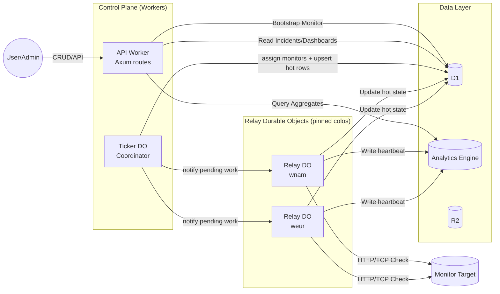
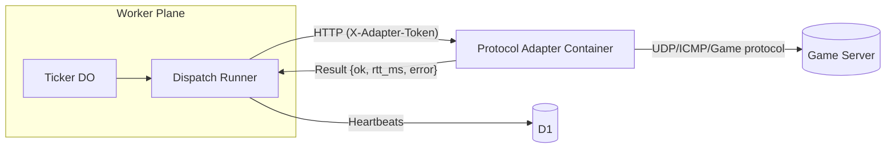

# Saavy Uptime Architecture (Living Doc)

This document tracks the major components, data flows, and runtime responsibilities. Update it whenever a new subsystem lands so future contributors can see the whole picture at a glance.

## Core Entities

| Component | Role | Notes |
| --- | --- | --- |
| **Access (Cloudflare Zero Trust)** | Authenticates every request to the API/frontend via CF Access JWTs. | Axum extractors verify `CF_Authorization` headers against Access JWKS. |
| **API Worker (Axum)** | Frontend/API entry point. Hosts CRUD routes, internal admin endpoints, and exposes helper APIs to the Durable Object/dispatch runner. | Stateless; runs in a fresh isolate per request. |
| **Ticker Durable Object** | Control-plane coordinator that maps monitors to Relays, keeps org cadence metadata, and handles failover. | Writes `monitor_dispatch_hot` rows, rotates round-robin assignments, and only wakes regional Relays that have work. |
| **Relay Durable Objects (regional)** | Per-region runners pinned via `locationHint` that own a shard of monitors and self-schedule on their own alarms. | Execute checks from their colo, update D1/AE, and emit status back to the control plane; multiple Relays can be assigned to a single monitor for all-region mode. |
| **Dispatch Runner (internal Axum route)** | Executes individual monitor checks. Receives DO fan-out requests via `POST /api/internal/dispatch/run`. | Updates D1 hot state, emits heartbeat events, manages incidents. |
| **D1 (SQLite)** | Hot relational store for orgs, monitors, dispatch metadata, and incident state. | Stores only the current monitor “hot state”—no raw heartbeat log—so writes stay cheap. |
| **Analytics Engine (AE)** | High-volume metrics store (uptime %, latency percentiles, player counts). | Dispatch runner writes heartbeats directly after each check. |
| **R2** | Cold storage for future replay payloads/archives. | Optional; no longer required for heartbeat rotation now that AE owns historical data. |
| **Frontend (Vite/React)** | Dashboard + bootstrap flow. Uses TanStack Router/Query + shadcn UI. | Dev-only controls (e.g., “Warm ticker”) hit internal APIs. |

## Repo layout (backend)

| Path | Purpose |
| --- | --- |
| `apps/backend/src/` | Axum Worker (main entry point) plus feature modules (`monitors`, `heartbeats`, etc.). |
| `apps/backend/src/cloudflare/` | Shared bindings/helpers for Cloudflare services (D1 helpers, Durable Object bindings). These modules are compiled into the Worker crate so rust-analyzer can index them. |
| `apps/backend/src/external/` | Actual implementations of “external” entry points—Durable Objects (each file gets its own `#[event(fetch)]` macro). |
| `apps/backend/src/cloudflare/durable_objects/` | Types shared between the Worker and DO (e.g., `TickerConfig`, error enums). |
 
This split lets us keep feature logic grouped by domain (monitors, heartbeats, incidents) while still isolating Cloudflare-specific runtime components. When browsing the repo: look in `cloudflare/` for shared bindings/types, and in `external/` for the actual DO code that compiles into separate entry points.

## Health Check Flow (Relay model)



1. **User action** (bootstrap org, create monitor) hits the API Worker and persists config to D1.
2. **Ticker DO** now operates as a control-plane scheduler: it rotates each monitor through an ordered list of Relays (round-robin) or targets every Relay for all-region mode, updating `monitor_dispatch_hot` with the destination relay and cadence metadata.
3. **Relay DOs** are pinned to specific Cloudflare regions via `locationHint`. Each Relay keeps the monitor subset it owns in local state, wakes via its own `alarm()`, pulls pending rows that reference it, marks them running, executes the health check from its colo, and reports completion back to D1/AE.
4. Relays can still call the existing dispatch runner route while we migrate logic, but the long-term plan is to execute HTTP/TCP checks directly inside the Relay so requests originate from the pinned region without extra hops.
5. Frontend/API consume D1/AE just like before, but now they also gain visibility into which Relays handled each heartbeat (for DAG + geo visualizations).

## Future Visual Hooks

- Dispatch events (Ticker assignments + Relay executions) feed a real-time DAG visualizer + scheduling timeline (see `docs/highlight-features.md`).
- Heartbeats with `cf.colo` metadata now map directly to the Relay that executed the check, powering the geo map and incident replay.
- `monitor_dispatch_hot` stays the source of truth between the control plane and Relays: each row records the destined Relay, dispatch state, and timestamps so auditors can replay the exact routing decisions.
- Relay placement metadata (location hints, colo identifiers, friendly names) will surface in org settings so users can curate their geography mix without redeploying infrastructure.
- Containers can complement Workers for protocols beyond HTTP/TCP; see “Protocol Adapter Container” below.
- Analytics Engine writes happen synchronously: once the dispatch runner updates D1 it records the heartbeat in AE (subject to per-monitor sample rates).
- R2 is optional now that AE holds historical data, but remains available for future replay payloads or cold archives if requirements change.

## Relay Execution Modes

- **Round-robin** – each monitor stores `relay_rotation` metadata (ordered list of Relay IDs). On every cadence the Ticker advances the pointer, writes a single `monitor_dispatch_hot` row targeting that Relay, and notifies it. Only one Relay wakes, minimizing CPU burn.
- **All-region** – monitors that demand global coverage emit one pending row per Relay in a single transaction. Every Relay wakes exactly once, so we get parallel execution without polling loops.
- **Failover** – if a Relay misses its deadline, the Ticker can reassign the row to the next Relay and bump an error counter, ensuring the hot path stays single-hop while still tolerating regional outages.

Relay metadata (colo, friendly name, capabilities) will be user-selectable in the dashboard so orgs can decide whether a monitor pins to a specific geography, rotates across several, or explodes to “all regions”.

## Durable Object Placement & Location Hints

- Cloudflare currently accepts coarse-grained hints: `wnam`, `enam`, `weur`, `eeur`, `apac`, `oc`. Each Relay DO instance is created with one of these hints so Workers routes the instance to the closest colo in that region.
- We’ll surface a `location_hint` field in the Relay config table plus `wrangler.toml` defaults so Deploy Button users get a sensible starter set (e.g., wnam, weur, apac). Advanced users can add more by creating additional Relay namespaces.
- The Worker bindings will use `DurableObjectNamespace::id_from_name_with_options` so we can pass the hint at stub creation time, guaranteeing placement without spinning up multiple scripts.
- Because hints are *advisory*, the Ticker also tracks observed `cf.colo` per Relay and can quarantine a region if Workers temporarily migrates the instance.
- Jurisdictions are limited to `eu` and `fedramp`. We automatically map WEUR/EEUR hints to the `eu` jurisdiction (true residency guarantee) and treat every other hint as “global” because Cloudflare does not currently allow locking a DO to North America/APAC/etc.—location hints simply bias placement.


## Protocol Adapter Container (UDP/ICMP/Game checks)

Workers still lack UDP/raw socket support. To support Minecraft/Valve queries (or ICMP ping)—and even Docker socket monitoring for hobby clusters—we can introduce a small Cloudflare Container that exposes an HTTP API and runs native socket code. The Worker dispatch runner decides per monitor whether to execute locally or delegate to the adapter.



- **When to use:** Only for monitors whose `kind` requires UDP/ICMP/game-specific protocols. HTTP/HTTPS/TCP stay inside Workers.
- **Communication:** Worker POSTs `{ protocol, target, timeout_ms, config }` to `/check` with an auth token. Container responds with `{ ok, rtt_ms, error }`.
- **Deployment:** Containers are GA; declare them in `wrangler.toml` and deploy alongside the Worker. Set `PROTOCOL_ADAPTER_URL` + `ADAPTER_AUTH_TOKEN` env vars so the runner can call the adapter securely.

Example adapter skeleton:

```rust
// apps/protocol-adapter/src/main.rs
use axum::{routing::{get, post}, Router, Json};
use serde::{Deserialize, Serialize};
use std::net::UdpSocket;
use std::time::{Duration, Instant};

#[tokio::main]
async fn main() {
    let app = Router::new()
        .route("/check", post(handle_check))
        .route("/health", get(|| async { "OK" }));

    let listener = tokio::net::TcpListener::bind("0.0.0.0:8080")
        .await
        .expect("bind");
    axum::serve(listener, app).await.unwrap();
}

#[derive(Deserialize)]
struct CheckRequest {
    protocol: String,
    target: String,
    timeout_ms: u32,
}

#[derive(Serialize)]
struct CheckResponse {
    ok: bool,
    rtt_ms: u64,
    error: Option<String>,
}

async fn handle_check(Json(req): Json<CheckRequest>) -> Json<CheckResponse> {
    let start = Instant::now();
    let result = match req.protocol.as_str() {
        "udp" => check_udp(&req.target, req.timeout_ms),
        "icmp" => check_icmp(&req.target, req.timeout_ms),
        "minecraft" => check_minecraft(&req.target, req.timeout_ms),
        _ => Err("unsupported protocol".to_string()),
    };
    let rtt_ms = start.elapsed().as_millis() as u64;
    Json(match result {
        Ok(_) => CheckResponse { ok: true, rtt_ms, error: None },
        Err(e) => CheckResponse { ok: false, rtt_ms, error: Some(e) },
    })
}

fn check_udp(target: &str, timeout_ms: u32) -> Result<(), String> {
    let socket = UdpSocket::bind("0.0.0.0:0").map_err(|e| format!("bind: {e}"))?;
    socket
        .set_read_timeout(Some(Duration::from_millis(timeout_ms as u64)))
        .map_err(|e| format!("timeout: {e}"))?;
    socket.connect(target).map_err(|e| format!("connect: {e}"))?;
    socket.send(&[0x00, 0x01, 0x02]).map_err(|e| format!("send: {e}"))?;
    let mut buf = [0u8; 1024];
    socket.recv(&mut buf).map_err(|e| format!("recv: {e}"))?;
    Ok(())
}

fn check_icmp(_: &str, _: u32) -> Result<(), String> {
    Err("icmp not yet implemented".to_string())
}

fn check_minecraft(_: &str, _: u32) -> Result<(), String> {
    Err("minecraft not yet implemented".to_string())
}
```

The Worker can call this adapter selectively using `Fetch::Request` and insert the returned metrics into `heartbeats`. This lets us support hobbyist-friendly game protocols without leaving the Cloudflare ecosystem.

Keep this doc updated as new services or bindings land.
