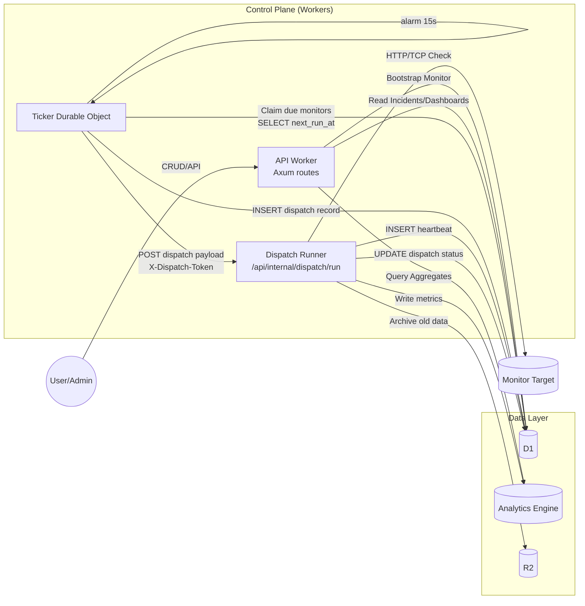
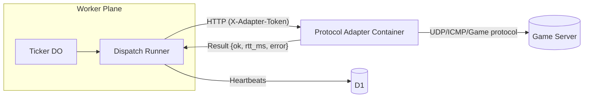

# Saavy Uptime Architecture (Living Doc)

This document tracks the major components, data flows, and runtime responsibilities. Update it whenever a new subsystem lands so future contributors can see the whole picture at a glance.

## Core Entities

| Component | Role | Notes |
| --- | --- | --- |
| **Access (Cloudflare Zero Trust)** | Authenticates every request to the API/frontend via CF Access JWTs. | Axum extractors verify `CF_Authorization` headers against Access JWKS. |
| **API Worker (Axum)** | Frontend/API entry point. Hosts CRUD routes, internal admin endpoints, and exposes helper APIs to the Durable Object/dispatch runner. | Stateless; runs in a fresh isolate per request. |
| **Ticker Durable Object** | Statefully schedules monitors via `alarm()`; resolves membership and claims due monitors. | Stores per-org cadence, error counters, and writes `monitor_dispatches` rows. |
| **Dispatch Runner (internal Axum route)** | Executes individual monitor checks. Receives DO fan-out requests via `POST /api/internal/dispatch/run`. | Today stubbed; later performs HTTP/TCP checks, writes heartbeats, updates incidents. |
| **D1 (SQLite)** | Hot relational store for orgs, monitors, dispatch metadata, incidents, heartbeats (rolling 30 d). | Accessed via workers-rs D1 bindings. |
| **Analytics Engine (AE)** | High-volume metrics store (uptime %, latency percentiles, player counts). | Populated via queue consumer Worker that batches heartbeat summaries. |
| **Workers Queues** | Reliable pipeline between dispatch runner and AE consumer. | Queue producer lives in the Worker; consumer Worker flushes to AE with retries. |
| **R2** | Cold storage for archived heartbeats and replay payloads. | Phase 2+ once archival cron ships. |
| **Frontend (Vite/React)** | Dashboard + bootstrap flow. Uses TanStack Router/Query + shadcn UI. | Dev-only controls (e.g., “Warm ticker”) hit internal APIs. |

## Repo layout (backend)

| Path | Purpose |
| --- | --- |
| `apps/backend/src/` | Axum Worker (main entry point) plus feature modules (`monitors`, `heartbeats`, etc.). |
| `apps/backend/src/cloudflare/` | Shared bindings/helpers for Cloudflare services (D1 helpers, Durable Object bindings, queue producers). These modules are compiled into the Worker crate so rust-analyzer can index them. |
| `apps/backend/src/external/` | Actual implementations of “external” entry points—Durable Objects and queue consumers. Each file gets its own `#[event(fetch/queue)]` macro at build time, but we keep them in Cargo so tooling works. |
| `apps/backend/src/cloudflare/durable_objects/` | Types shared between the Worker and DO (e.g., `TickerConfig`, error enums). |
| `apps/backend/src/cloudflare/queues/` | Queue message types + helper functions to publish messages. |

This split lets us keep feature logic grouped by domain (monitors, heartbeats, incidents) while still isolating Cloudflare-specific runtime components. When browsing the repo: look in `cloudflare/` for shared bindings/types, and in `external/` for the actual DO/queue consumer code that compiles into separate entry points.

## Health Check Flow



1. **User action** (bootstrap org, create monitor) hits the API Worker and persists config to D1.
2. **Ticker DO** wakes via `alarm()`, loads org cadence, queries D1 for due monitors, and writes `monitor_dispatches` rows.
3. For each due monitor, the DO POSTs to `/api/internal/dispatch/run` (authenticated via `X-Dispatch-Token`). Each request spins up a fresh Worker isolate (same script).
4. **Dispatch runner** executes the check (HTTP/TCP/game protocol), writes a heartbeat row, pushes metrics to AE, updates incidents, and marks the dispatch row completed.
5. **Frontend/API** read from D1/AE for dashboards, incidents, and future visualizations (DAG, geo map, etc.). R2 archiving handles long-term storage.

## Future Visual Hooks

- Dispatch events feed a real-time DAG visualizer + scheduling timeline (see `docs/highlight-features.md`).
- Heartbeats with `cf.colo` metadata power the geo map and incident replay.
- `monitor_dispatches` table is the bridge between control plane (DO) and runner instrumentation—keep it append-only for reliable auditing.
- Containers can complement Workers for protocols beyond HTTP/TCP; see “Protocol Adapter Container” below.
- Analytics Engine writes flow through Workers Queues:
  1. **Dispatch runner** publishes a `HeartbeatSummary` message to the `heartbeat-summaries` queue after each check (or according to the org’s sample rate).
  2. A **queue consumer Worker** (see `apps/backend/src/external/queues/heartbeat_summaries.rs`) receives batches of messages, attaches metadata (`sample_rate`, dataset name), and writes them to AE via the REST API.
  3. If AE writes fail, the queue retries; we only `ack` after a successful flush so no heartbeats are lost.
  4. Future analytics datasets (incident context, cost telemetry) can either share this queue (with a `type` field) or use dedicated queues if we need different batching.
- D1 → R2 archival will likely use a scheduled Worker or Durable Object cron (not a queue for now).

## Protocol Adapter Container (UDP/ICMP/Game checks)

Workers still lack UDP/raw socket support. To support Minecraft/Valve queries (or ICMP ping)—and even Docker socket monitoring for hobby clusters—we can introduce a small Cloudflare Container that exposes an HTTP API and runs native socket code. The Worker dispatch runner decides per monitor whether to execute locally or delegate to the adapter.



- **When to use:** Only for monitors whose `kind` requires UDP/ICMP/game-specific protocols. HTTP/HTTPS/TCP stay inside Workers.
- **Communication:** Worker POSTs `{ protocol, target, timeout_ms, config }` to `/check` with an auth token. Container responds with `{ ok, rtt_ms, error }`.
- **Deployment:** Containers are GA; declare them in `wrangler.toml` and deploy alongside the Worker. Set `PROTOCOL_ADAPTER_URL` + `ADAPTER_AUTH_TOKEN` env vars so the runner can call the adapter securely.

Example adapter skeleton:

```rust
// apps/protocol-adapter/src/main.rs
use axum::{routing::{get, post}, Router, Json};
use serde::{Deserialize, Serialize};
use std::net::UdpSocket;
use std::time::{Duration, Instant};

#[tokio::main]
async fn main() {
    let app = Router::new()
        .route("/check", post(handle_check))
        .route("/health", get(|| async { "OK" }));

    let listener = tokio::net::TcpListener::bind("0.0.0.0:8080")
        .await
        .expect("bind");
    axum::serve(listener, app).await.unwrap();
}

#[derive(Deserialize)]
struct CheckRequest {
    protocol: String,
    target: String,
    timeout_ms: u32,
}

#[derive(Serialize)]
struct CheckResponse {
    ok: bool,
    rtt_ms: u64,
    error: Option<String>,
}

async fn handle_check(Json(req): Json<CheckRequest>) -> Json<CheckResponse> {
    let start = Instant::now();
    let result = match req.protocol.as_str() {
        "udp" => check_udp(&req.target, req.timeout_ms),
        "icmp" => check_icmp(&req.target, req.timeout_ms),
        "minecraft" => check_minecraft(&req.target, req.timeout_ms),
        _ => Err("unsupported protocol".to_string()),
    };
    let rtt_ms = start.elapsed().as_millis() as u64;
    Json(match result {
        Ok(_) => CheckResponse { ok: true, rtt_ms, error: None },
        Err(e) => CheckResponse { ok: false, rtt_ms, error: Some(e) },
    })
}

fn check_udp(target: &str, timeout_ms: u32) -> Result<(), String> {
    let socket = UdpSocket::bind("0.0.0.0:0").map_err(|e| format!("bind: {e}"))?;
    socket
        .set_read_timeout(Some(Duration::from_millis(timeout_ms as u64)))
        .map_err(|e| format!("timeout: {e}"))?;
    socket.connect(target).map_err(|e| format!("connect: {e}"))?;
    socket.send(&[0x00, 0x01, 0x02]).map_err(|e| format!("send: {e}"))?;
    let mut buf = [0u8; 1024];
    socket.recv(&mut buf).map_err(|e| format!("recv: {e}"))?;
    Ok(())
}

fn check_icmp(_: &str, _: u32) -> Result<(), String> {
    Err("icmp not yet implemented".to_string())
}

fn check_minecraft(_: &str, _: u32) -> Result<(), String> {
    Err("minecraft not yet implemented".to_string())
}
```

The Worker can call this adapter selectively using `Fetch::Request` and insert the returned metrics into `heartbeats`. This lets us support hobbyist-friendly game protocols without leaving the Cloudflare ecosystem.

Keep this doc updated as new queues, services, or bindings land.
